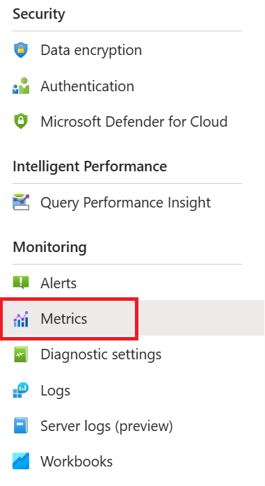
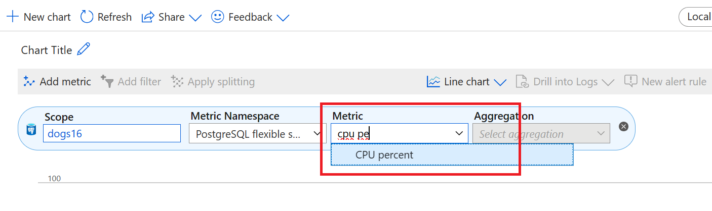
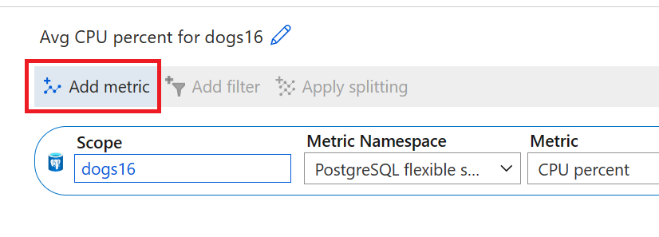
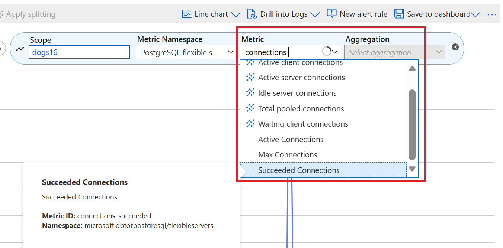
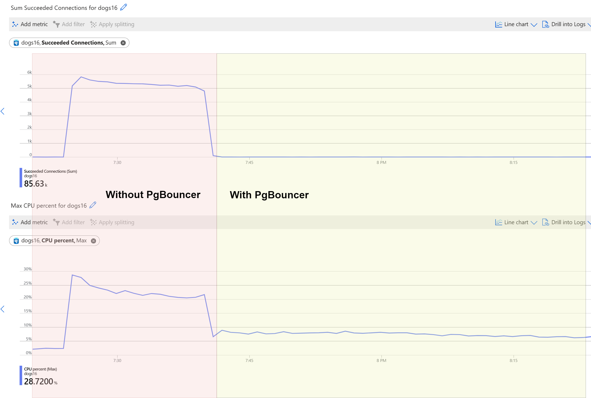

# The Ask

 **Application Owner:** "I just looked into the metrics and see higher CPU usage than normal, along with a high number of succeeded connections. I'm not sure if you can help me with that? These connections come from a new app that is making a lot of short connections. I've checked the CPU utilization, memory utilization, and succeeded connections in the metrics, and this is what I see:"

# Investigation

To investigate the issues mentioned by the application owner, we'll start by examining the CPU and memory usage, as well as the number of connections. Begin by navigating to the Azure portal. Once there, access the metrics section: 

In the 'Metric' dropdown, search for and select 'CPU percent'. 

Next, add another metric: look for 'connections' and choose 'successful connections'. 

Analyze and compare both sets of data to validate the values. You should now see the two metrics plotted one under another in the following way:

!> It's evident that the CPU utilization increases concurrently with the number of connections. This correlation suggests that multiple short-lived connections can definitely lead to excessively high CPU usage. Understanding this pattern is crucial in identifying the root cause of the performance issue.

# Solution
 **Application Owner:** "Thank you! After enabling pgBouncer, I see that the CPU utilization went down by around 16 percent!"

