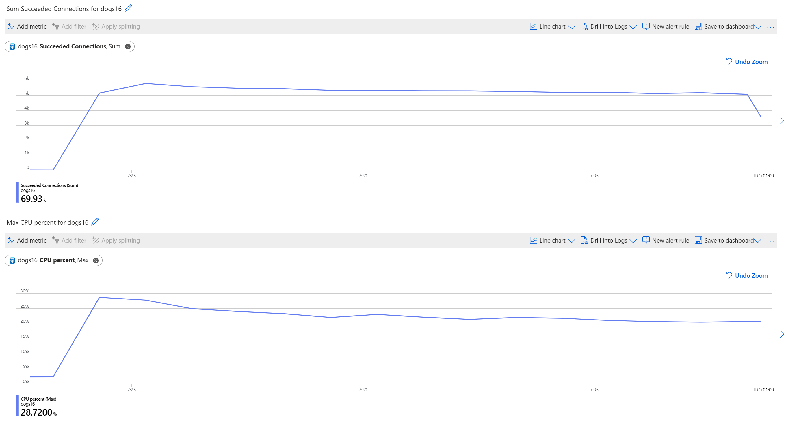

# The Ask

**Application Owner:** "I just looked into the metrics and see higher CPU usage than normal, along with a high number of succeeded connections. I'm not sure if you can help me with that? These connections come from a new app that is making a lot of short connections. I've checked the CPU utilization, memory utilization, and succeeded connections in the metrics, and this is what I see:"

