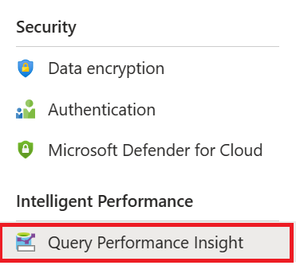
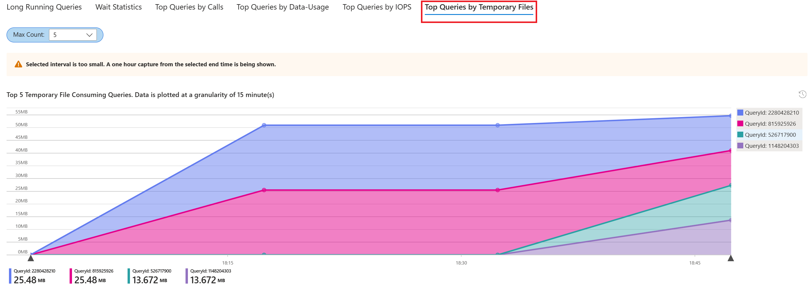
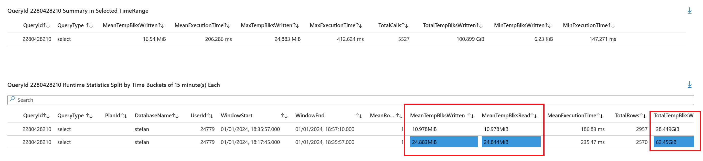
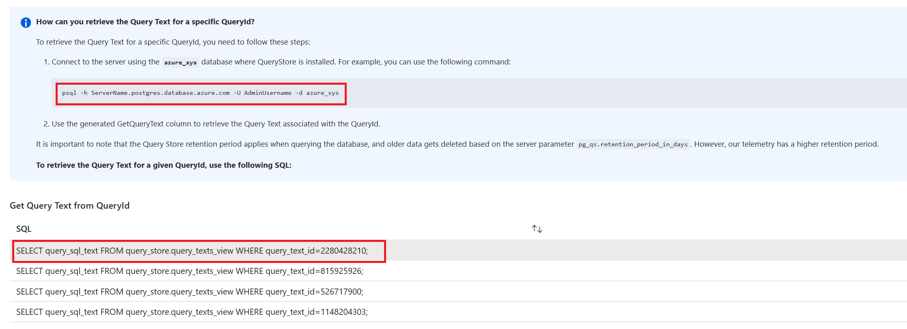
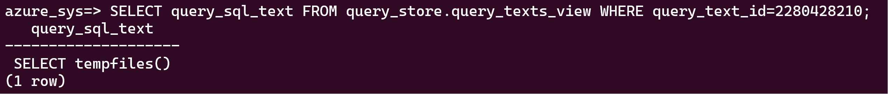
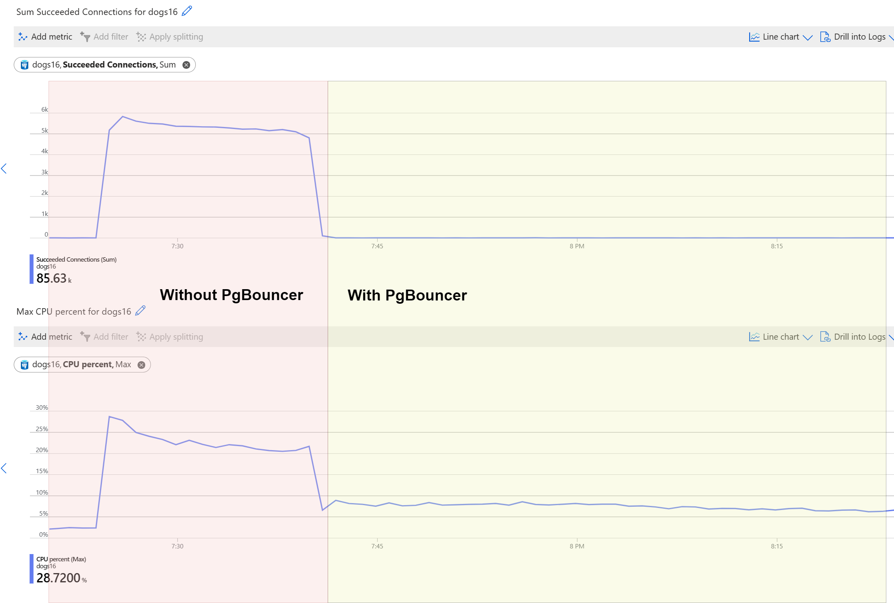

# The Ask

?>  **Application Owner:** "We've observed a significant slowdown in a function called 'tempfiles' within our system. It used to be executed around **6,000** times in 10 minutes, but now it's only managing about **4,000** executions in the same period. Could you help us resolve this issue? I suspect it might be related to something called '**temporary files**'."

# Investigation

To address the issue raised by the Application Owner, our first step is to examine the generation of temporary files, which is likely impacting the function's performance.

### Accessing Query Performance Insight

1. **Open Query Performance Insight:** Look for the 'Query Performance Insight' option. This tool provides detailed insights into query performance, which is crucial for our investigation.
    

2. **Select 'Top Queries by Temporary Files' Tab:** Within Query Performance Insight, navigate to the 'Top Queries by Temporary Files' tab. This section specifically focuses on queries that are generating temporary files.
    

### Detailed Analysis of Temporary File Sizes

1. **Scroll Down for Detailed Metrics:** In the 'Top Queries by Temporary Files' tab, scroll down to view more detailed metrics about the temporary files generated by each query.

2. **MeanTempBlksWritten and MeanTempBlksRead Metrics:** Look for the 'MeanTempBlksWritten' and 'MeanTempBlksRead' columns. These metrics will show you the average size of temporary files generated by each execution of the query.

3. **TotalTempBlksWritten Metric:** The 'TotalTempBlksWritten' metric is also crucial. It represents the total amount of temporary file blocks written throughout all executions of the query.



### Case Example

In our example, let's say the mean temporary file size per query execution is approximately 24 MB. However, when multiplied by the number of times the query has been executed, the total amount of temporary file data accumulates to a staggering 62 GB! This significant volume of temporary file generation could be a key factor in the slowdown of the system's function.

**Expected Outcome:** By examining these metrics, we gain a clear understanding of not just the presence of temporary files, but their size and total impact across all query executions. This detailed analysis is crucial for developing a strategy to address the excessive temporary file generation and optimize the function's performance.


Having analyzed the temporary file sizes, our next objective is to confirm if the query in question is indeed a call to the `tempfiles()` function, as mentioned by the Application Owner.

### Decrypting the Query ID

To accurately identify the query, we need to decrypt its ID. This involves connecting to your database instance and performing specific steps:

1. **Connect to Your Database Instance:** Log into your Azure Database for PostgreSQL.

2. **Access the `azure_sys` Database:** Navigate to the `azure_sys` database within your instance. For instance use this command: `psql azure_sys`.

3. **Execute the Query from Query Performance Insight:** On the Query Performance Insight page, scroll to the bottom to find the query in question. The queries are anonymized for privacy reasons, but you'll see a specific query ID provided. Execute this query within the `azure_sys` database to decrypt the ID and reveal the actual query.




### Confirming the Function Call

Once you have executed the query with the query ID:

- Check the output to see if it corresponds to a call to the `tempfiles()` function.
- This step is crucial for confirming whether the identified performance issue is directly related to the function of concern.

**Expected Outcome:** By decrypting the query ID and examining the actual query, you will be able to determine if the performance issue is indeed linked to the `tempfiles()` function. This confirmation is key to moving forward with targeted optimization strategies.




# Solution: Optimizing Memory Allocation with `work_mem`

The investigation has indicated that the performance slowdown is likely due to insufficient memory allocation for query operations, leading to an excessive reliance on disk-based temporary files. To address this, we need to adjust the `work_mem` parameter in PostgreSQL.

## Understanding `work_mem` Configuration

The `work_mem` parameter in PostgreSQL dictates the amount of memory to be used for internal sorting and hash operations before writing to temporary disk files. There are several levels at which this parameter can be adjusted:

1. **Function/Procedure Level:** Modify a specific function or procedure using `ALTER FUNCTION` or `ALTER PROCEDURE`.
2. **Database Level:** Apply changes to the entire database with `ALTER DATABASE`.
3. **User or Role Level:** Alter settings for a specific user or role using `ALTER USER` or `ALTER ROLE`.
4. **Session Level:** Adjust `work_mem` for the current session.
5. **Global Level:** Change the parameter globally in the Server Parameters blade in the Azure portal.

## Choosing the Right Approach

Selecting the appropriate level for adjusting `work_mem` depends on several factors, including the amount of memory needed and the characteristics of the workload on your system. For the purpose of this exercise:

- **Exercise Task:** Increase `work_mem` in the Server Parameters blade. This global change will affect the entire server and is a straightforward way to provide more memory for all operations.

**Note:** While increasing `work_mem` can improve performance by reducing disk-based operations, it's important to balance this with the overall memory available to avoid overconsumption of resources.

# Determining the Appropriate `work_mem` Value

To optimize `work_mem` effectively, we need to understand the memory requirements of the specific query that's causing performance issues. In this case, it's the query executed by the `tempfiles()` function.

## Steps to Examine the Function

1. **Log into Your Database Instance:** Use the connection variables provided in the Connect blade of the Azure portal.

2. **Switch to the Correct Database:** Ensure you are in the correct database for this exercise, which is named `main`.

3. **View the Function's Content:** Run the command `\sf tempfiles` to display the body of the function. This will show you the exact query or queries being executed by the function.

### Expected Query Output

Upon executing `\sf tempfiles`, you should see the following query as the sole operation performed by the function:

```sql
PERFORM *
FROM generate_series(1, 1000000)
ORDER BY 1;
```

## Modifying and Executing the Query

1. **Modify the Query:** Copy the original query from the `tempfiles()` function. Replace `PERFORM` with `SELECT`, as `PERFORM` is used within PL/pgSQL functions to execute a command without returning a result. The modified query should look like this:

   ```sql
   EXPLAIN ANALYZE SELECT * FROM generate_series(1, 1000000) ORDER BY 1;
   ```
   
2. **Execute the Modified Query**: Paste and execute this modified query in your PostgreSQL terminal. This will not only execute the query but also provide a detailed query plan.
3. **Expected Query Plan Output**: Upon executing the modified query, you should see an output similar to the following:
   
   ```sql
       QUERY PLAN
    ---------------------------------------------------------------------------------------------------------------------------------------
     Sort  (cost=119425.35..121925.35 rows=1000000 width=4) (actual time=177.395..233.392 rows=1000000 loops=1)
       Sort Key: generate_series
       Sort Method: external merge  Disk: 11768kB
       ->  Function Scan on generate_series  (cost=0.00..10000.00 rows=1000000 width=4) (actual time=52.937..115.908 rows=1000000 loops=1)
     Planning Time: 0.035 ms
     Execution Time: 257.681 ms
    (6 rows)
   ```
    
   This output reveals that the sort operation is using an external merge sort, which is spilling to disk (indicated by the Disk: 11768kB). This spill to disk is a key indicator that the `work_mem` setting may be too low for the query's requirements.


## Monitoring the Changes

Once PgBouncer is enabled and the application is reconfigured to connect through port 6432, allow some time for the changes to reflect in metrics. Then, revisit the Azure metrics. You should observe a notable decrease in CPU utilization and a more manageable number of connections. This exercise demonstrates the effectiveness of PgBouncer in optimizing connection management and reducing CPU strain in Azure Database for PostgreSQL.


?>  **Application Owner:** "Thank you! After enabling PgBouncer, I see that the CPU utilization went down by around 16 percent!"



